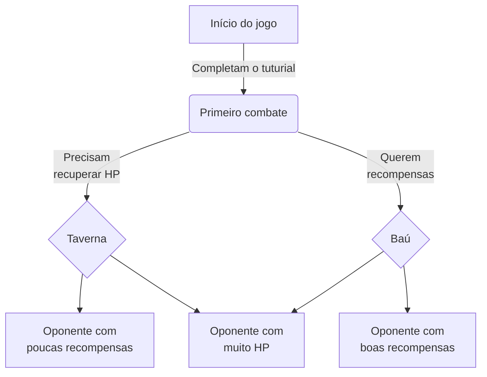

# Last Fate, um cardgame roguelike

### Sobre o projeto:

- Composição da empresa: José Ivan Amorim Jr. ([JIvanAmorim](https://github.com/JIvanAmorim)) e Lucas Francisco Machado ([splinter888](https://github.com/splinter888)).
- Nome da empresa: Syzygy Team.
- Nome do game: Last Fate.

### Premissa:

Last Fate é um desafiador cardgame roguelike cooperativo (2 jogadores), no qual a dupla lutam juntos contra oponentes controlados pelo computador (PvE) em partidas de cardgame e, ao vencerem, ganham recompensas como experiência, cartas novas para seu baralho, ou até poderes especiais para cartas que já possuem. Antes de embarcarem na aventura, cada jogador escolhe seu mercenário, que definirá seu baralho inicial e estilo de jogo, e se jogam no mundo passando por três mapas: Floresta Verdejante, Reindo Afundado e Céus Recaídos. O rumo da história depende das escolhas desses aventureiros.

## Jogo ideal

### Gameplay:

Last Fate seria cardgame contando com milhares de cartas com artes e efeitos visuais exclusivos, feitos em pixel art caprichados. A progressão operaria com upgrades (para cartas e certos aspectos dos Mercenários), sistema de experiência e leveling, e conquistas (achievements) com a realização de certos feitos, combos, escolhas, etc. Os oponentes, controlados pelo computador, iriam aumentando de dificuldade com o decorrer da progressão dos jogadores, sempre mantendo um desafio constante.

### Storytelling:

A história seria contada de forma interativa, no qual as escolhas dos jogadores influenciariam no decorrer e final da jornada. Entre os combates seriam apresentados cutscenes e diálogos, no estilo de visual novel, com a presença dos Mercenários (jogadores) interagindo com as situações e NPCs do universo do jogo.

## Universo 

### Mundo:

Em Last Fate, o mundo é repleto de aventuras e mistérios que se estendem tanto por terra quanto pelo vasto oceano. Na terra firme, há pouca tecnologia, várias vilas e aldeias, cada uma com sua própria civilização e políticas. Enquanto que, no mar, é repleto de exploradores em embarcações, seres aquáticos-antropomorfos morando em cidades submarinas e criaturas em ilhas remotas. Até que um grande evento cósmico acontece...
Na jogatina, os jogadores serão os mercenários, que são os indivíduos misteriosos que vivem desconexos da sociedade, mas que, com o mundo estando em um caos, viram a oportunidade de se reinserirem na população, além de investigarem o que está acontecendo.

### Personagens

Mercenários (Cada um da dupla deve assumir um)
- Ophelia, a Luz no Fim-do-túnel
- Vampy, a Coletora de Essências
- Reinold, o Acumulador de Cacarecos
- Dee Jane, a Rainha do Som Desconexo

## Regras e objetivos

### Preparação

No jogo, a dupla joga cooperativamente, cada um com seu baralho. Antes de iniciar a aventura, cada um pode alterar seu deck inicial, além de equipar poderes que auxiliam no desafio.

### Mapa da aventura

O mapa é montado intercalando entre batalhas e encontros, sendo estabelecido rotas com bifurcações, permitindo vários caminhos com diferentes resultados. Embarcando na jornada, os jogadores podem decidir juntos qual será o próximo destino deles. 

- Exemplo

### Batalhas

- A vida dos jogadores é compartilhado, mas a Mana e as cartas na mão não são
- Cada jogador possui seu turno, e depois, passam a ação ao oponente
- Em cada início de turno, quem tem a ação possui a Mana é reinstituída e compra uma carta
- Quem começa o jogo é decidido de forma aleatória, podendo começar pelo oponente ou por um da dupla

Cartas
- Cada carta possui um custo, em Mana, a ser jogado
- São divididos em três categorias: tropas, magias e auras
- Cada tropa possui ataque e vida (podendo ter subtipo, efeitos)
- Cada magia possui um efeito instantâneo
- Cada aura possui um efeito permanente (podendo ter contagem regressiva e efeitos para essa contagem)

Objetivo
- Zerar a vida do oponente, sem que ele zere o seu
- Caso vitoriosos, a dupla prossegue o mapa
- Caso derrotados, a dupla retorna para o começo do mapa, porém mais poderosos

### Progressão pós-derrota

O game possui um sistema de experiência (vinculados a cada mercenário). Subir de nível desbloqueia novas cartas para o baralho inicial, poderes para serem usados dentro e fora de combates, além de aumentarem vida inicial e porcentagem de chance de encontrarem cartas mais poderosas.

## Referências

### Estrutura de jogo:

Cardgames roguelikes
- Slay the Spire
- Inscription
- The Path of Champions (Legends of Runeterra)

Cardgames
- Hearthstone
- Magic the Gathering
- Gwent

Roguelikes
- Enter the Gungeon
- Soul Knight
- Dead Cells
- 1-Bit Rogue

### Estética:

Mapa 1: Floresta Verdejante
- The Legend of Zelda: Ocarina of Time
- Adventure Time

Mapa 2: Reino Afundado
- Bioshock 1 & 2
- Subnautica
- Abzu
- Atlantis (Cidade)

Mapa 3: Céus Recaídos
- Outer Wilds
- No Man’s Sky
- 2001: Uma Odisseia no Espaço
- Dark Star (Universo de League of Legends)

Pixel Art Style
- Dead Cells 
- Undertale
- Soul Knight
- The Legend of Zelda: A Link to the Past
- Stardew Valley
- Hyper Light Drifter
- Celeste

Músicas low-bit
- Undertale
- The Legend of Zelda (Clássicos)
- Sonic the Hedgehog (Clássicos)

### Enredo:

- Nimona
- Arcane

## Financeiro

- Jogo Free-2-play
- Propagandas disponíveis p/ pequenas recompensas aos jogadores
- Cosméticos pagos
- Battle Pass
- Distribuição 50/50 para os dois desenvolvedores
